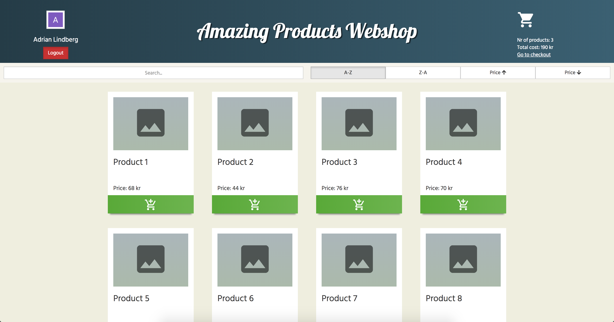
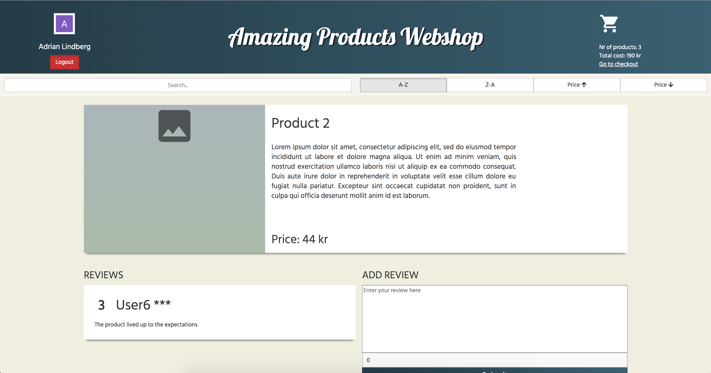
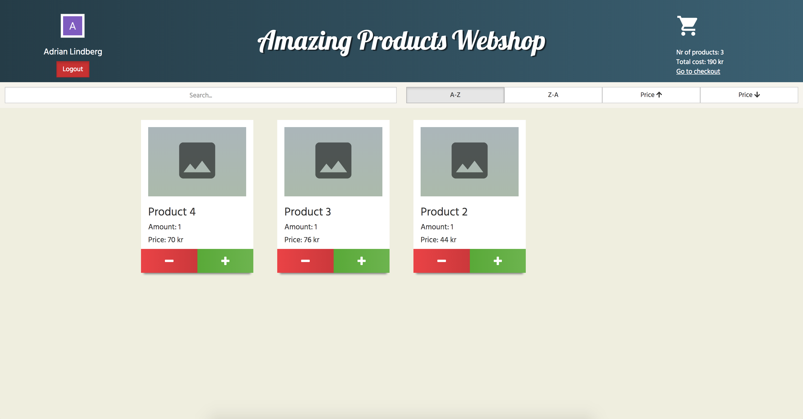
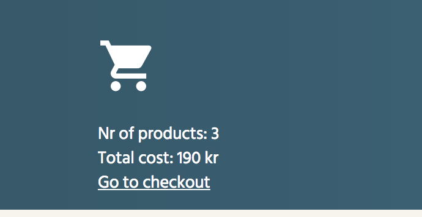

Web programming project
=====

**Webshop made with:** React, ExpressJS, NodeJS, Sequelize.

```
  How to start:

  ./startup.sh

  How to build:

  ./build.sh
```


### Client:
Folder: [client](client/)
```
  Should be run on a port that != 3000 example: 3001.
```

### Server:
Folder: [react-backend](react-backend/)
```
  Port is set to 3000.
```

### Screenshots:






### Authors:
- Adrian Lindberg  - _(lindbergan)_
- Jonathan Sundkvist  - _(jsundkvist)_
- Jonatan Nylund  - _(nylundj)_
- Johannes Matsson  - _(BalooCTH)_
